Testing Documentation - JJ Plamoottil
- the point of testing enables proper workflow  and it connects the Back End to the Front End efficiently and vice versa.
  
JIRA ticket

Test / Document all custom routes in authRoutes.ts
** Keystone database is used for this project and is rendered by mySQL 9.3.0 via DBeaver.
1. the permission configuration in the backend was improperly setup and didn’t allow the front end to connect.
2. Most of the models in the backend have an 
access:
1.   This access section defines what actions are allowed for the user to take. 
2.    I manually changed all of them to just return true, giving myself 100% authority. 
3.    These access properties are meant to limit user action and must be decided carefully. 
4.    During backend testing, I determined the most restrictive access properties that still allow the front end to function as intended.
      1.    activityLog.ts (lines 10-16)
            
            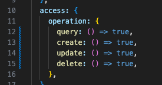
      2.    invitationTokens.ts 
            (lines8-13)
            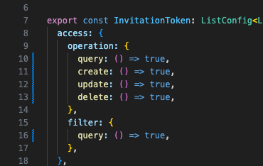

            (lines55-60)
            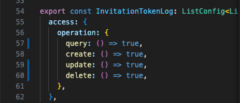

      3.    milestone.ts
            (lines55-61)
            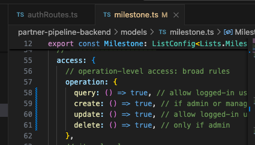

      4.    project.ts
            (lines8-27)
             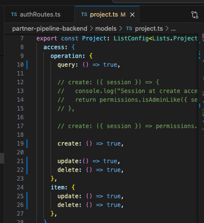

            (lines71-77)
            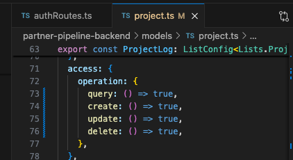

            (lines91-97)
            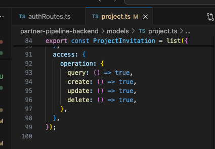

      5.    users.ts
            (lines17-30)
            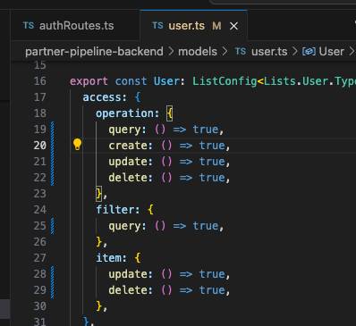

            (lines89-95)
            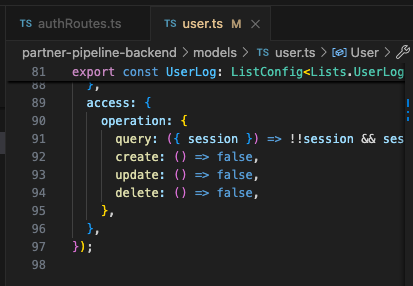

        * there is no 'access' in the index.ts file under models folder
        * Next is Testing the Routes folder

7. Under Routes, I located the authRoutes.ts file and tested two tests using GET requests on Postman:
   1. "/auth/google"
        - This functionality redirects users to Google for authentication
        - 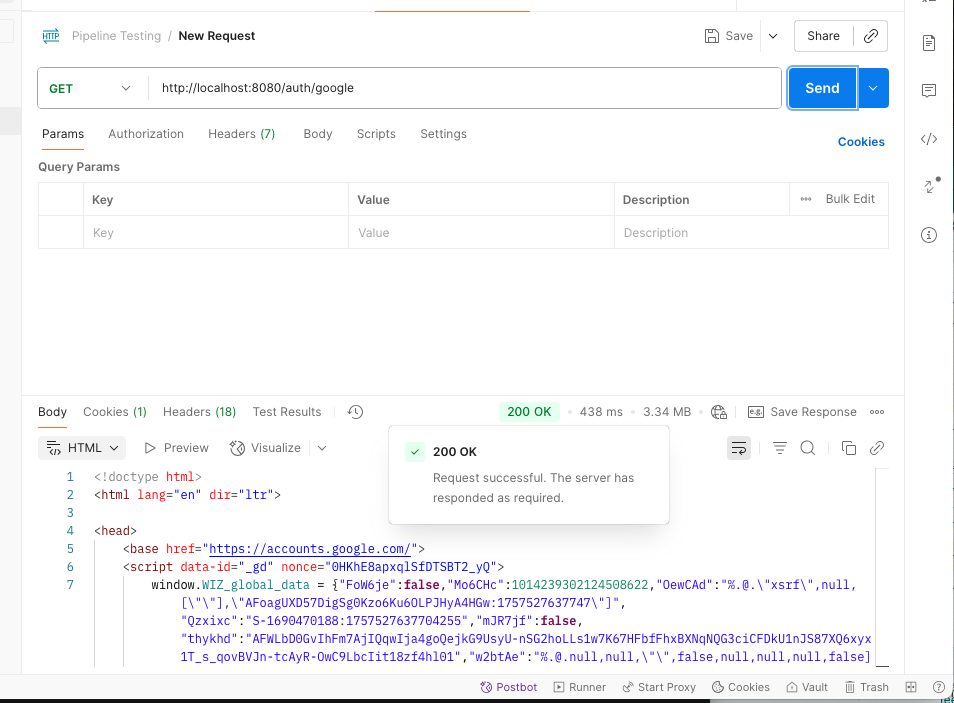
   2. "/auth/google/callback"
        - This functionality serves as a callback as part of Google OAuth and if successful then it redirects user to the dashboard/home.
        - 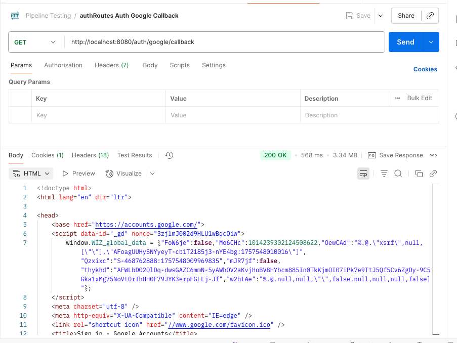
  

8. activityLogRoute.ts has a GET request to test and POST 

   1. "/api/projects/:projectId/activity-log"
   2. using the UI on the BE, I had to create a test under prjects to create an projectID which is 6ada6386-b955-4082-891b-f7ced2274e09
   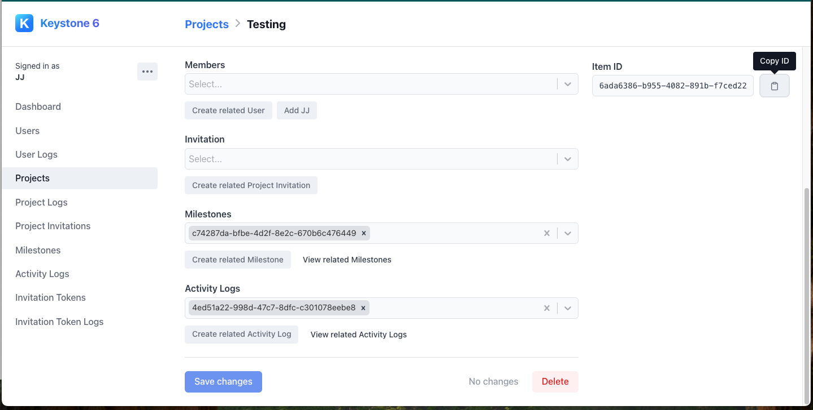
      1. GET response for activityLog:
        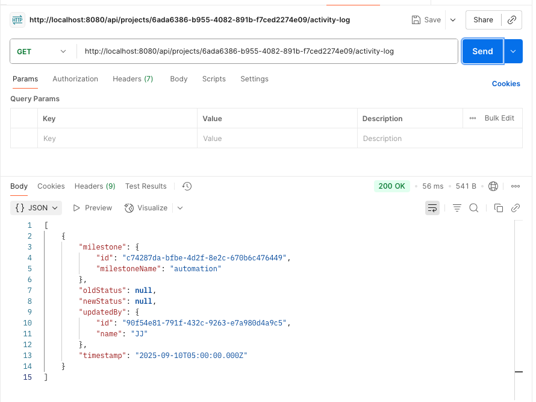

      2. POST response for activityLog:
        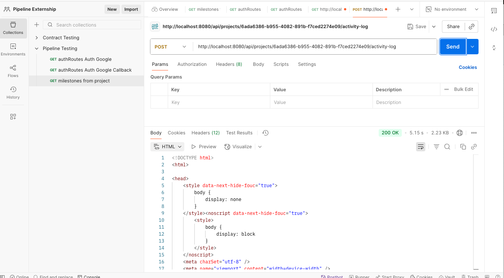

9. milestoneDataRoutes.ts has a GET request to test and POST 
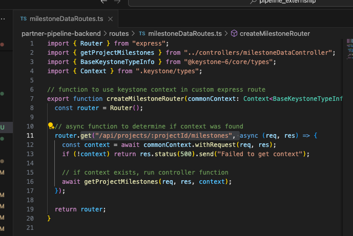
   1. "/api/projects/:projectId/milestones"
   2. using the UI on the BE, I had to create a test under projects to create an projectID which is 6ada6386-b955-4082-891b-f7ced2274e09
   
      1. GET response for milestoneDataRoutes.ts:
        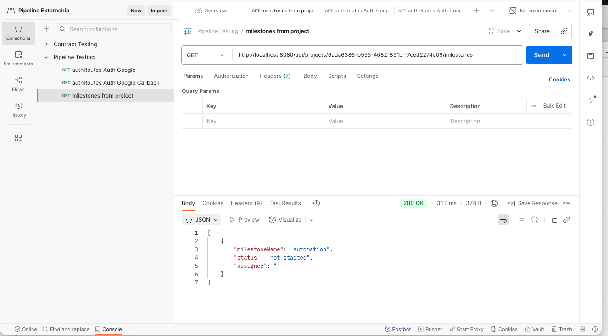

      2. POST response for milestoneDataRoutes.ts:
        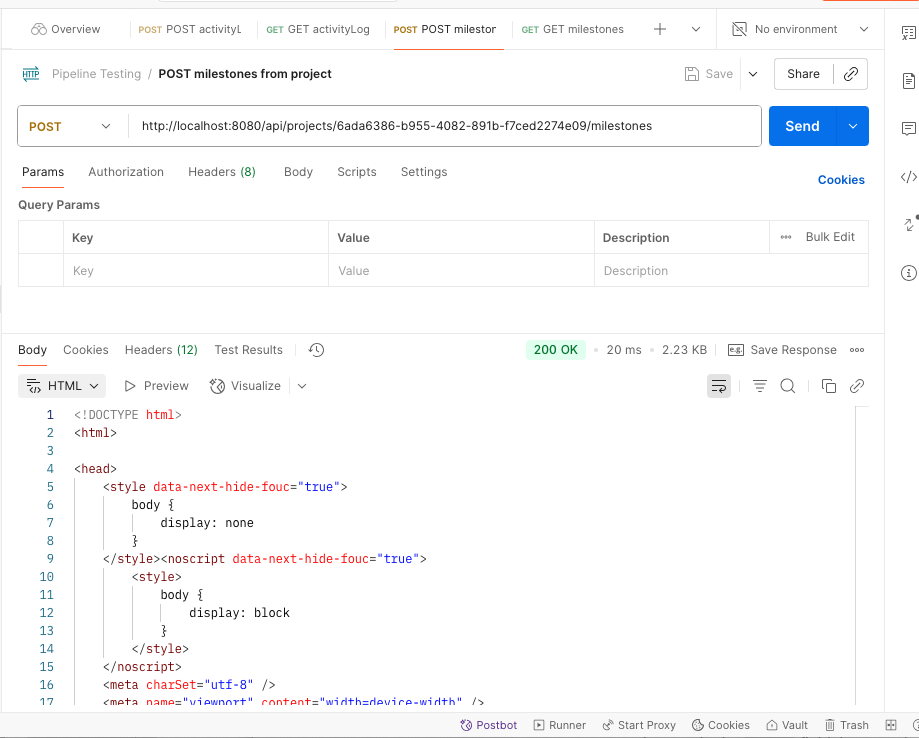

10.   invitationsRoutes.ts has a GET request to test and POST 
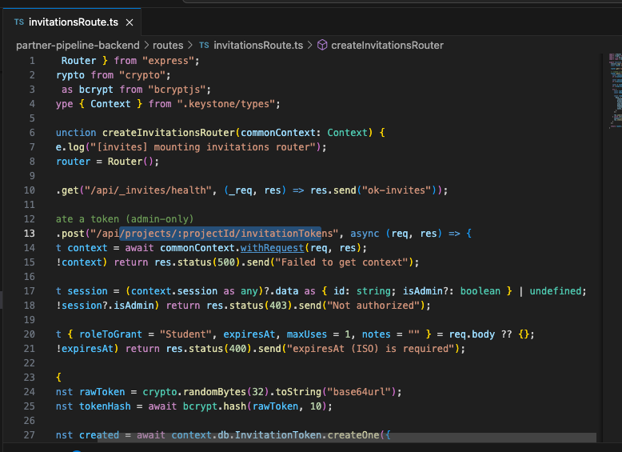
   1. "/api/projects/:projectId/invitationTokens"
   2. using the UI on the BE, I had to create a test under projects to create an projectID which is 6ada6386-b955-4082-891b-f7ced2274e09
   
      1. GET response for invitationsRoutes.ts:
        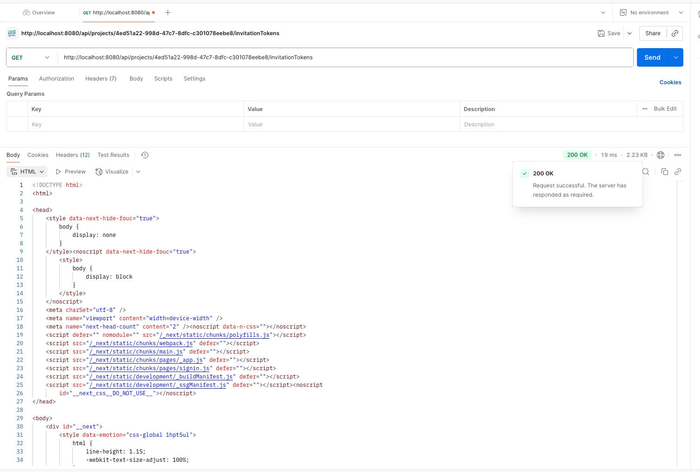

      2. POST response for invitationsRoutes.ts: 403 Error Code (goal achieved since we do not want to create a new resource) 
        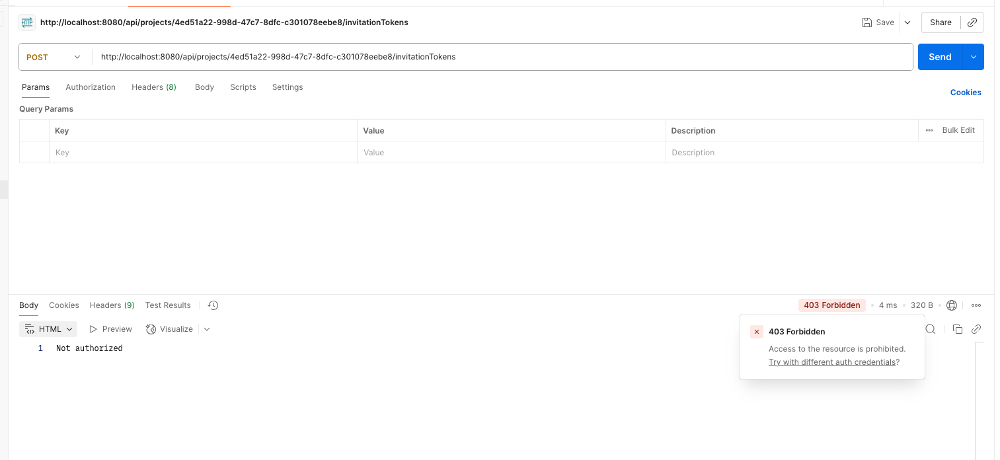